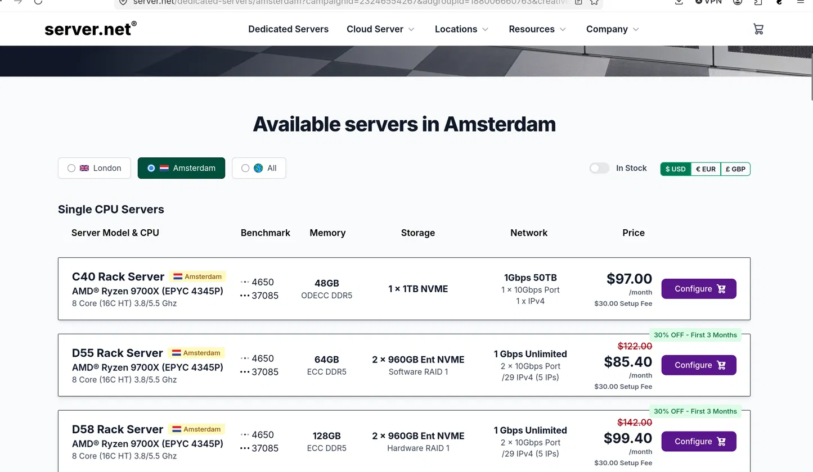
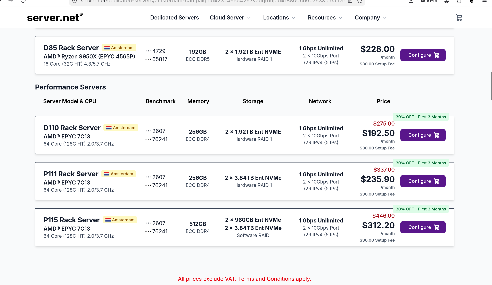

## Q:
What do you think about this  for BahyWay.Ecosystemv4.0?: https://www.serverschmiede.com/konfigurator_bulk/en/dell-poweredge-r440-19-1u-server-10x-25-sff-sas-4x-u2-nvme-2x-intel-xeon-scalable-lga3647-ddr4-ecc-perc-raid-2x-psu
## Ans:
Honest verdict: it's a tempting price, but this machine argues against your own sealed target, and the physics of the 1-billion-under-1-second law is the reason.

**The core problem: memory bandwidth**

The R440 is Dell Gen14 — 2x LGA3647 sockets with the Intel C620 chipset, 16 DDR4 DIMM banks, and PCIe 3.0 risers. That means Skylake/Cascade Lake silicon from roughly 2017–2019:

- Dual-socket Cascade Lake gives you 12 channels of DDR4-2933 max ≈ **~280 GB/s theoretical**, split across two NUMA domains that Nasaru would have to shard around.
- The EPYC 9354P you targeted gives 12 channels of DDR5-4800 on a **single socket** ≈ **~460 GB/s**, no cross-socket UPI penalty, plus AVX-512 at full width.

For the 1B law, a full scan is at minimum 16 GB of KAKI keys alone, and realistically several multiples of that once Mandatory EAV attributes ride along. The scan is bandwidth-bound, not core-bound. Buying a 52-core dual-socket Cascade Lake box gets you many cores fighting over roughly half the effective bandwidth of a single Genoa socket — the worst trade for your workload.

**Secondary problems**

- **PCIe 3.0 only.** The NVMe drives in that configurator (Micron 7450/7500, Samsung PM9A3, even PCIe 5.0 Micron 7600) would all be throttled to Gen3 speeds — an x16 extender caps at ~16 GB/s for all four U.2 bays combined. Your SSD stem-locality diagnostics in Karānu deserve better telemetry than a bottlenecked bus.
- **1U acoustics.** As a solo ZZP, if this sits anywhere near where you work, a 1U dual-socket screamer is a genuine quality-of-life mistake. 2U or tower is the sane form factor outside a datacenter.
- **Perf/watt.** Two 125–150W 2019-era CPUs idle hungry. Dutch energy prices make old dual-socket iron more expensive over 3 years than the sticker suggests.
- **GPU/Vulkan.** The DubSar Visualizer runs on Vulkan on the bare-metal host; a 1U with one full-profile Gen3 x16 slot leaves almost no room for a capable GPU.

**Where this box *would* make sense**

As a cheap secondary — an Ansible-targeted KVM lab node, a SUSA gateway test host, or a CI runner for playbook gates. At ~€1,000–1,500 configured (2× Gold 6230R, 256GB, HBA330, a couple of SATA enterprise SSDs) it's honest value for that role. Just not as the sovereign compute host that carries the performance law.

**Better use of the same shop**

Serverschmiede has a PowerEdge AMD EPYC category and HP DL385 EPYC line. A refurbished **single-socket EPYC Milan** system (7443P/7543P class — 8× DDR4-3200 ≈ 204 GB/s, PCIe 4.0, one NUMA domain) lands inside your €1,500–3,000 envelope today and is a coherent stepping stone toward Genoa. If refurb Genoa (9004/SP5) has dropped into range by now, that's still the true target.

Want me to draft the comparison as a decision tablet — R440 vs. Milan single-socket vs. 9354P — with the bandwidth-per-euro arithmetic worked out against the 1B/1s law?

## YES PLESE PROCEED:

Here is the decision tablet, with the arithmetic grounded in the law itself.

**The law's demand, stated as bandwidth**

One full sweep of 1B particles reads at minimum 16 GB (KAKI keys alone). A realistic judgment pass — keys plus hot Mandatory EAV attributes plus orbit membership — is closer to 48–64 GB per sweep. To finish under 1 second *with headroom for the actual computation* (Voronoi, δc centroids, deficit functional), you want sustained memory bandwidth of roughly **3–4× the sweep size**, i.e. **150–250 GB/s effective**, on as few NUMA domains as possible.

|                                         | **Dell R440** (2× Xeon Gold 6230R)                    | **Milan 1P** (R7515 / DL385 Gen10+, EPYC 7543P-class)                 | **Genoa 1P** (EPYC 9354P)                                                                           |
| -----------------------------------------| -------------------------------------------------------| -----------------------------------------------------------------------| -----------------------------------------------------------------------------------------------------|
| Era / socket                            | 2019, 2× LGA3647                                      | 2021, 1× SP3                                                          | 2022, 1× SP5                                                                                        |
| Cores                                   | 52C / 104T (2×26)                                     | 32C / 64T                                                             | 32C / 64T                                                                                           |
| Memory                                  | 12ch DDR4-2933, **2 NUMA domains**                    | 8ch DDR4-3200, 1 socket                                               | 12ch DDR5-4800, 1 socket                                                                            |
| Theoretical BW                          | ~281 GB/s (split 2×140)                               | ~205 GB/s                                                             | 460.8 GB/s                                                                                          |
| Practical BW (measured-class)           | ~200 GB/s, NUMA-penalized                             | ~170 GB/s, clean                                                      | ~370 GB/s, clean                                                                                    |
| PCIe                                    | 3.0 (NVMe throttled)                                  | 4.0 ×128                                                              | 5.0 ×128                                                                                            |
| AVX-512                                 | Yes (throttles clocks)                                | No (AVX2 only)                                                        | Yes, full-width Zen 4                                                                               |
| TDP                                     | 2× 150W                                               | 225W                                                                  | 280W default, 240–300W configurable                                                                 |
| Configured est. (NL/DE refurb)          | €2,000–2,600                                          | €1,800–3,000                                                          | €4,500–6,500 system (CPU alone runs ~€2,000–2,700: seen at ~$2,222 new-pull to ~$2,890 refurbished) |
| €/GB/s practical                        | ~€11–12                                               | ~€13–16                                                               | ~€13–16                                                                                             |
| Est. power cost, 24/7 × 3yr @ €0.30/kWh | ~€2,200–2,700                                         | ~€1,500–1,900                                                         | ~€1,900–2,400                                                                                       |
| Passes 1B/1s with computation headroom? | Marginal, and only with NUMA-aware sharding in Nasaru | Yes, tightly — key-scan comfortable, heavy multi-witness passes tight | Yes, with ~2× headroom                                                                              |

**What the arithmetic actually says**

The surprise is that €-per-GB/s is nearly flat (~€11–16) across all three. Price tracks bandwidth almost linearly in the refurb market. So the decision is *not* about value per euro — it's about three things the ratio hides:

1. **Absolute ceiling.** The law is stated in absolute seconds, not in euros. Only Genoa gives you 2× headroom above the 150–250 GB/s requirement; Milan sits right at it; the R440 sits under it once the NUMA tax is paid.
2. **Engineering friction.** The R440's bandwidth only materializes if Nasaru becomes NUMA-aware — tribe-shard placement pinned per socket, cross-socket orbit joins penalized. That's real code you'd write to serve dying silicon. Milan and Genoa are single-domain: the code you write is the code you keep.
3. **Power is a second purchase.** In the Netherlands, the R440 roughly buys itself again in electricity over three years.

**Verdict**

- **R440: decline** for the sovereign host. Acceptable only as a ~€1,200 lab/CI node if you ever want one.
- **Milan single-socket: the rational bridge.** An R7515 or DL385 Gen10 Plus (2U, quiet enough, PCIe 4.0 NVMe bays, 8×32GB DDR4-3200) lands inside €1,500–3,000 today and lets you build and profile the full gate chain against real hardware now. One search result even notes that SP5-based Genoa servers are rarely available refurbished at meaningful savings yet — which matches the pricing above.
- **Genoa 9354P: the sealed target, deferred.** Prices are still ~2× your ceiling for a complete system. A budget side-door exists — the EPYC 9334 (Genoa 32C, 2.7GHz) has appeared refurbished at around £960 (~€1,100) for the CPU — but DDR5 RDIMMs and an SP5 board still push the system past €3,000.

My recommendation: buy Milan now as the profiling and law-validation platform, let Genoa refurb prices fall for 9–15 months, then promote. The 1B/1s law is proven on architecture, not on a specific die — Milan proves the code path; Genoa collects the seal.

Also worth asking ServerLama in Houten whether they have R7515/DL385 Gen10 Plus stock — local pickup beats importing 26 kg from Germany.

## Q:
Why you didn't calculate GPU with the other calculations?
## Ans:
Fair catch — that was a real gap, not a deliberate scoping. I treated the 1B/1s law as a CPU/memory-bound scan problem and left the GPU as "the Visualizer's concern." But under your own architecture that split doesn't hold: the DubSar Visualizer runs natively on the host via Vulkan, so the GPU is a first-class member of the host, and it changes the arithmetic in three ways I should have calculated.

**1. The GPU has the best memory bandwidth in the whole machine**

The CPU comparison was fought over 200–460 GB/s. A single consumer GPU beats all three columns: a Radeon RX 7900 XTX moves ~960 GB/s over its own VRAM; an RTX 4090 ~1,008 GB/s. If the hot working set lives *resident in VRAM*, the sweep-bandwidth problem largely dissolves — the law's bottleneck migrates from DRAM channels to a different question entirely, which is:

**2. The feed pipe — and this retroactively executes the R440**

VRAM residency only works if you can get particles in. That pipe is the PCIe slot, and now the generation gap becomes brutal in seconds, not percentages:

| | PCIe gen ×16 | Effective throughput | Time to upload 16 GB of KAKI keys |
|---|---|---|---|
| R440 | 3.0 | ~14–15 GB/s | **~1.1 s — fails the law on transfer alone** |
| Milan (R7515/DL385) | 4.0 | ~28–30 GB/s | ~0.55 s |
| Genoa (9354P) | 5.0 | ~55–60 GB/s | ~0.28 s |

So the R440 can't even *feed* a GPU inside the time budget, before a single shader runs. (In practice you'd upload once and stream deltas via KISPU commit boundaries rather than re-uploading per second — but cold-start, epoch rollover, and full re-shard events all hit the pipe at full width, and the law shouldn't have an asterisk for cold starts.)

**3. VRAM capacity sets the residency floor**

1B particles × 16 bytes = 16 GB for keys alone, before instance buffers, depth, and the membrane geometry. That rules out 12 GB and makes 16 GB cards marginal. **24 GB is the honest floor** for the full-population Šala/NASARU view. Which points at: RX 7900 XTX 24 GB (~€850–1,000), RTX 4090 24 GB (~€1,500+), or workstation RTX A5000/W7800 class.

**The sovereignty argument decides the vendor**

On Fedora bare-metal, AMD RDNA cards run on the fully open-source Mesa/RADV Vulkan stack in the mainline kernel — no proprietary blob, no out-of-tree kernel module, no vendor userspace you can't audit. NVIDIA still effectively requires the proprietary driver for real Vulkan performance (NVK is improving but not there for this workload). For a platform whose entire identity is *sovereign pure-stack, auditable, no black boxes*, an AMD GPU is the philosophically consistent choice — CPU and GPU both AMD, both driven by open code, one coherent trust chain for UrNammu to attest.

**Physical fit and the corrected budget picture**

- **R440 (1U):** one full-profile Gen3 slot, no auxiliary GPU power headers, no thermal budget. A 24 GB card is physically impossible. Third strike.
- **R7515/DL385 Gen10+ (2U):** can host a 300W double-width GPU, but needs the GPU enablement kit/riser and the right PSUs, and consumer Radeons in Dell/HP 2U chassis bring cable and airflow quirks. Doable, ask the vendor to confirm the riser before purchase.
- **Tower alternative worth reconsidering:** if the GPU is first-class, a Milan/Genoa *tower* (or SP3/SP5 workstation board in a quiet chassis) is friendlier than 2U — native GPU power, quiet cooling, sits in an Amsterdam office without sounding like Schiphol.

Corrected totals: Milan system €1,800–2,600 **+ 7900 XTX ~€900** ≈ **€2,700–3,500** — brushing the top of your €1,500–3,000 envelope rather than sitting comfortably inside it. That's the true cost of the law once the Visualizer is counted as a law-bearing component rather than an accessory. The conclusion still holds — Milan now, Genoa later — but the GPU belongs in the purchase order now, not later: the Vulkan code path, VRAM residency layout, and delta-streaming design all get proven against the same card you'll carry forward to the Genoa host.

Want me to fold this into the tablet as a fourth axis — GPU feed-rate and VRAM residency per platform — so the whole decision document is complete for the archive?

## Q:
What about AMD 1TB EYCP RAM does that also include in the Genoa (9354P)?
## Ans:
Short answer: no — my €4,500–6,500 Genoa estimate assumed a modest 256–384GB population, not 1TB. And right now, 1TB of DDR5 is where the whole plan collides with a market crisis you should know about before committing a single euro.

**The DRAM crisis changes this calculation completely**

The AI buildout has gutted the server memory market: DRAM prices rose ~50% through 2025 with further 30% and 20% increases projected into 2026, and DDR5 64GB RDIMM modules were projected to cost twice by end of 2026 what they did in early 2025 — and it played out worse than projected: DDR5 RDIMM prices rose 100–116% between early 2025 and Q1 2026, with analysts projecting tightness into 2027. One tracker currently shows the split starkly: DDR4 at a median of ~$8.33/GB versus DDR5 at ~$36.49/GB.

**What 1TB actually costs on Genoa, done correctly**

The population law matters here: to get the 460.8 GB/s the 9354P was chosen for, you must fill **all 12 channels, one DIMM per channel**. Capacity comes in fixed steps:

| Population | Capacity | Speed | Cost at current street (~€550–700 per 64GB stick, per recent eBay listings around $628–695) |
|---|---|---|---|
| 12× 32GB | 384GB | 4800 MT/s, full BW | ~€3,600–4,500 |
| 12× 64GB | 768GB | 4800 MT/s, full BW | **~€6,600–8,400** |
| 12× 96GB | 1,152GB (~1.1TB) | 4800 MT/s, full BW | ~€9,000–12,000 |
| 8× 128GB | 1TB | **Broken** — 4 empty channels, ~2/3 bandwidth lost | Don't. This defeats the CPU's entire purpose |

So "Genoa with 1TB" is realistically a **€13,000–18,000 machine** today — the RAM alone costs 3–5× your entire €1,500–3,000 envelope. As one tracker put it, Genoa's 12×64GB single-socket configuration reaching 768GB at full bandwidth is precisely the tier that became the shortage's poster child.

**Does the law even need 1TB?**

Run the arithmetic against your own particle model: 1B KAKI keys = 16GB. Add Mandatory EAV hot attributes, orbit membership, Voronoi cell state, Šību witness accumulators, τ-rank buffers — a generously padded hot set is 150–300GB. Add the seven EnkiDB daemons, KVM VMs, and page cache, and **512–768GB is the honest requirement. 1TB is prestige, not law.** Capacity beyond the hot set adds zero bandwidth — 12×32GB and 12×128GB deliver the identical 460 GB/s.

**And this is the strongest argument yet for the Milan bridge**

Milan runs DDR4-3200, which the crisis largely spared: refurbished DDR4 has risen 30–50% but starts from a far lower base and remains the value play, performing identically for capacity-driven workloads on exactly the Dell 14th/15th-gen and HPE Gen10 platforms sold refurbished. Concretely:

- **512GB DDR4-3200 (8× 64GB) on Milan: roughly €900–1,400.**
- **512GB DDR5-4800 (8× 64GB… wait, 12 channels — 12× 48GB isn't a standard part, so 384 or 768GB) on Genoa: €3,600–8,400.**

Same half-terabyte of law-relevant hot capacity, at one-fifth the price, on hardware you can buy this month. The Fadam Floor applies to procurement too: Apsu (the perfect machine) is approached, never purchased.

**Revised sealed recommendation**

Milan single-socket + 512GB DDR4-3200 + PCIe 4.0 NVMe + 24GB RDNA GPU ≈ €3,000–3,800 all-in — slightly above the old ceiling, but it now carries the *entire* law: bandwidth floor, GPU feed, and full hot-set residency. Defer Genoa not just for the CPU price but until the DRAM cycle breaks — the DRAM market is famous for boom-bust cycles, and when the AI overbuild corrects, DDR5 will crash the way DDR4 did. Buying Genoa+DDR5 in 2026 means buying at the top of the memory market. That's not sovereignty; that's paying tribute.

## Q:
Is there any Software LAB in University or big companies that I can rent for creating my production level BahyWay.Ecosystem for the final 3 months of the Development Pipeline?
## Ans:
Yes — and for a 3-month production sprint there are really three routes. Let me give you the honest ranking, because one of them is dramatically better suited to your situation than the others.

**Route 1 — Rent Genoa-class bare metal commercially (the pragmatic winner)**

This is the quiet revelation: you can rent the exact silicon class you've been trying to buy, for three months, for less than the cost of the DDR5 sticks alone.

The standout is Hetzner's AX162 line: both variants house the AMD EPYC Genoa 9454P — 48 cores / 96 threads, Zen 4 — with the AX162-R base configuration carrying 256 GB of DDR5 ECC registered RAM plus 2× 1.92 TB Gen4 datacenter NVMe SSDs, and RAM configurable in steps up to 1,152 GB DDR5 ECC with up to 8 datacenter NVMe SSDs. Pricing: from €199.00/month plus a one-off €79.00 setup fee (excl. VAT).

So your 3-month production pipeline on a **48-core Genoa with 256GB DDR5** costs roughly **€680–800 total** — versus €13,000+ to own the equivalent. Even upgraded toward 512GB–1.1TB RAM, you'd likely stay in the €1,500–2,500 range for the full quarter, inside your original hardware budget. And critically for the law: this is *better* silicon than the 9354P target (9454P, 48C, same 12-channel DDR5-4800, same 460 GB/s class), so a validated 1B/1s benchmark run on it is a legitimate seal.

Why bare metal specifically fits sovereignty: it's a dedicated physical machine, not a VM — you can install from ISO, meaning your own Fedora, your own KVM/libvirt layer, your Ansible chain running exactly as the Way of Work prescribes, full-disk LUKS, no hypervisor beneath you that you don't control. The only sovereignty concession is physical custody, which a 3-month rental makes tolerable — nothing permanent lives there unencrypted.

Alternatives worth quoting in parallel: **Leaseweb** (Amsterdam-based — data stays in NL, and you can visit the building), **OVHcloud** and **Scaleway** (EPYC bare metal, EU), and **Cherry Servers**, which offers dedicated servers on literally the EPYC 9354P. One caution flag on Hetzner: some users have reported reliability issues specific to the AX162 series, including random reboots requiring hardware replacement — so bake a LAHMU–LAHAMU-style backup discipline into the rental from day one (which you'd do anyway).

**Route 2 — University / national research infrastructure (fits your academic arc, not your deadline)**

The Dutch national option is **SURF** — Snellius (the national supercomputer) and SURF Research Cloud. The honest catch: access normally flows through NWO compute grants or an affiliation with a research institution, which as a ZZP you'd get via the university co-applicant route you've already planned. That's a months-long application cycle, not a "start next Monday" lab. Same story for **EuroHPC** (LUMI etc.): they do have Benchmark and Development access tracks open to industry including SMEs, often free for open R&D — genuinely interesting for the *whitepaper benchmark chapter* — but the cycle time and the open-publication expectations make it the wrong vehicle for a proprietary production sprint. File this route under the AcadEngine track: use it later to independently reproduce the 1B/1s result on neutral hardware, which is worth far more academically than running dev on it.

**Route 3 — Corporate labs (mostly a mirage for this)** TNO, Dutch field labs, and vendor "innovation labs" (AMD, Dell) exist, but they're structured around partnerships and proofs-of-concept on their terms, with NDAs, shared IP conversations, and slow intake. For a solo architect with sealed IP and a 3-month clock, that's friction you don't want.

**The architecture that makes Route 1 sing**

Split the concern the way your own NUZI/SUSA doctrine suggests: the rented Genoa box is the *compute court* — headless, running Fedora + KVM + the seven EnkiDB daemons + Nasaru + the streaming harness, driven entirely by your numbered playbooks over WireGuard. The DubSar Visualizer stays *home* on your local AMD GPU, connecting to the remote EnkiMDB/EnkiDW ports across the tunnel. No GPU rental needed, no NVIDIA blob compromise, Vulkan stays local and sovereign. When the three months end, `ansible-playbook` rebuilds the entire court on whatever hardware you eventually buy — which is the whole point of the Way of Work: the machine is disposable, the playbooks are the estate.

And there's a bonus ending: after the sprint, the DRAM cycle has had three more months to break, and you buy your permanent Genoa host into a falling market instead of the current peak.

Want me to draft PB-325 as the remote-court bootstrap playbook — WireGuard mesh, Fedora hardening, LUKS, KVM provisioning, and the full EnkiDB chain deployment against a rented bare-metal target?
## Q:
Do you mean this in Route 1?: 

## Ans:
Right idea — dedicated bare metal, Amsterdam, monthly rental — but **wrong silicon class**. This page would quietly sell you a machine that fails the law before it boots.

Look closely at the CPU line: "Ryzen 9700X (EPYC 4345P)." The EPYC 4004/4005 series is a rebadged desktop Ryzen on the AM5 socket — the "EPYC" name is marketing dressing on consumer silicon. The number that matters:

| | These (EPYC 4345P / Ryzen 9700X) | Route 1 target (Genoa/SP5, e.g. Hetzner's 9454P) |
|---|---|---|
| Memory channels | **2** | **12** |
| Bandwidth | ~85–90 GB/s | ~460 GB/s |
| RAM on offer | 48–128GB | 256GB base, configurable up to 1,152GB DDR5 ECC |
| Cores | 8C/16T | 48C/96T |
| Verdict vs. 1B/1s law | ~5× under the bandwidth floor | Passes with headroom |

Remember the requirement we derived: **150–250 GB/s effective** to sweep 1B particles with computation headroom. A 2-channel chip at ~85 GB/s theoretical can't reach it no matter how high it clocks — 5.5 GHz on 8 cores is a sports car towing a freight train. And 48–64GB RAM can't even hold the key set plus one witness structure, let alone the 150–300GB hot set.

The tell to scan for on *any* rental page, regardless of provider:

1. **CPU model number**: EPYC **9**xx4 / 9xx5 (Genoa, Bergamo, Turin — SP5 socket). Four-digit codes starting with 4 (4345P, 4564P) are Ryzen-class; 8xx4 (Siena) is 6-channel — better, still not the target.
2. **RAM floor**: 256GB minimum, DDR5 ECC *registered*.
3. **Memory channels/bandwidth** if listed — the honest providers list it precisely because it separates these tiers.

Where this page's machines *would* fit your architecture: the D55 at ~$85/month is honestly decent as a **SUSA gateway / WireGuard endpoint / CI runner** — outward-facing roles that are network-bound, not bandwidth-bound. Just never as the compute court where Nasaru and the seven EnkiDB daemons live.

So for Route 1, compare like-for-like: Hetzner AX162-R (EPYC 9454P, 256GB DDR5, from €199/month + €79 setup), or ask Leaseweb Amsterdam and Cherry Servers specifically for their **EPYC 9004-series** dedicated configs and put the quotes side by side. If a provider's whole catalog is Ryzen-badged-as-EPYC, walk on — that's a hosting shop, not a compute court.

## Maybe These?:
