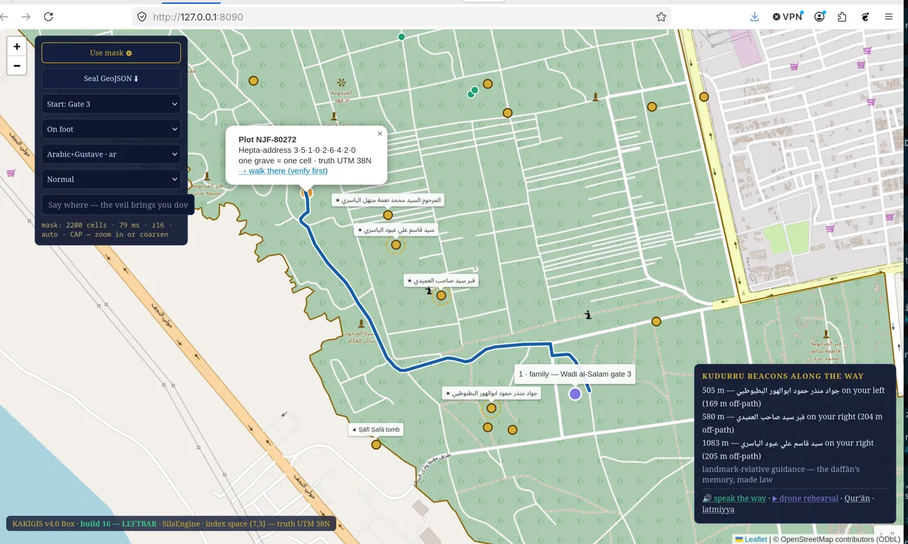
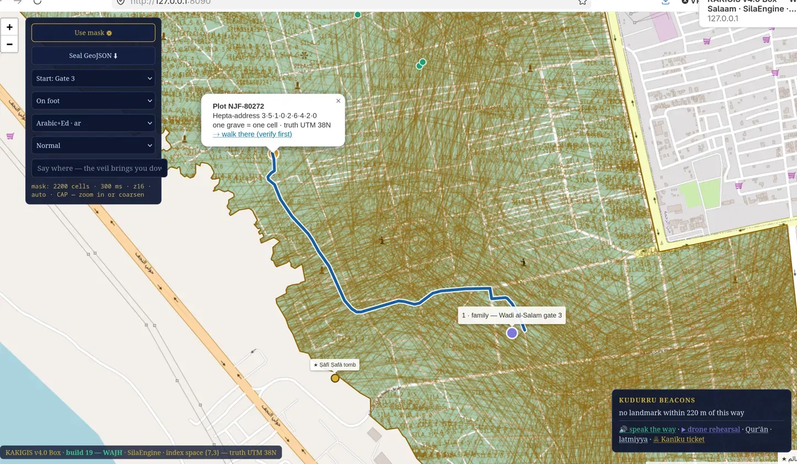
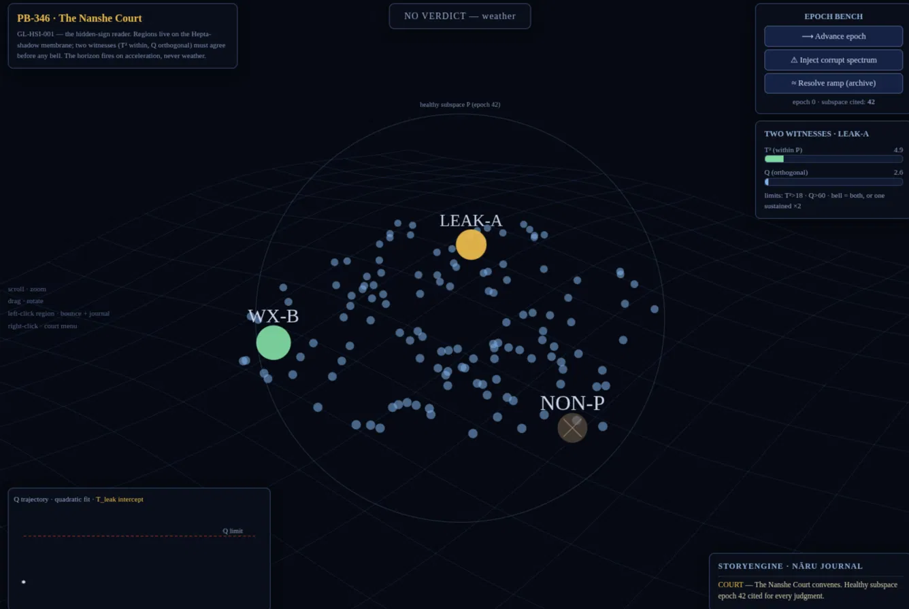
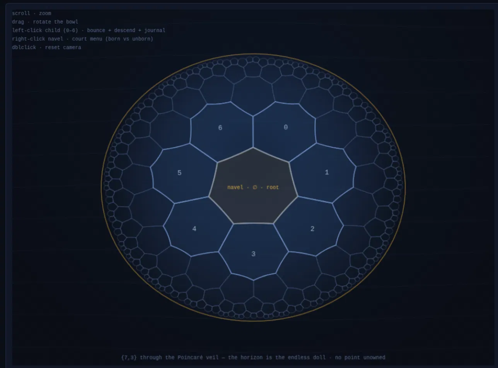

## Q:
Based on Triple-O : "Everything is a Particle ,But it matter how to use it"; HeptaSpaceMap (The Unified Membrane) that Create the specifice Membrane as Cemetery or Waternet Pipeline, or Airefield ..etc;  is also a Particle. Nebuchadnezzar the Unified Pattern is the one that will control the 7 Heptagons Pattern of Membrane Creation. Each Pattern will have its own Kakiv4.0 Identity-kaki so it can be  saved in EnkiMDB and queried by HeptaScript Query Language. When HeptaSpaceMap Create its Heptagons Area like the one in Najaf Wadi us-Salam Area , there will be NO empty spaces in it. Each 1 centimeter will got its Heptagon line in Fictoral like Russian Doll defined by Kakiv4.0 Identity value.So; HeptaSpaceMap Index will work based on its Kakiv4.0 Not because it found the requested deseeced name. the deceased Kakinv4.0 in their graves will have the HeptaSpaceMap Kakiv4.0 as event-kaki so it will shown in StorytellingEngine that it has been lay in the grave at datetime and in the location identified not only by location coordinates but also by the HeptaSpaceMap kakiv4.0. What do you think?



## Ans:
Bahaa — this is a strong closure move for Triple-O, and most of it is already lawful. Let me give you the honest review first, because there are two points that need judgment before anything gets sealed, and then I'll deliver the scaffolding.

**Where the design is right, and why**

The membrane-as-particle claim completes the ontology rather than decorating it. If everything is a particle, the thing that *births* particles cannot be an exception — HeptaSpaceMap getting its own KAKI means membrane creation is itself a witnessed event, the pattern lives in EnkiMDB like any other minted shape (this sits cleanly under GL-TPL-001 Pattern Minting), and the map can be aged, judged, and archived like anything else. Good.

The interment event-kaki is the most elegant part. A burial event that carries (deceased KAKI, cell KAKI, membrane KAKI, timestamp) through a KISPU commit gives you **two independent witnesses of place** — the UTM 38N truth coordinate and the hepta-address reached through the membrane KAKI. That is your two-witness doctrine applied to *location*, which no ordinary GIS has. The StoryEngine line ("laid in the grave at *t*, in cell *κ*, on membrane *κₘ*") falls out for free. And indexing by KAKI rather than by deceased-name search is exactly right: the name becomes a secondary facet, the identity is primary, and a base-7 address prefix is a radix trie — prefix descent is O(depth), which is the kind of structure that survives the 1-billion-particle sub-second law.

**Point one that needs precision: "no empty spaces"**

Regular heptagons cannot tile the Euclidean plane — the 128.57° interior angle doesn't divide 360°, so a literal gap-free heptagon carpet on flat UTM ground is mathematically impossible. But your own footer already contains the answer: **index space {7,3}**. The order-3 heptagonal tiling covers the *hyperbolic* plane perfectly, with no gaps and no overlaps. So the law should be stated the way your build banner already implies it: *the index lives in {7,3} space, where coverage is gapless and exact; truth stays UTM 38N; the veil is the mapping between them.* In truth space the cells come out quasi-heptagonal and boundary-matched — that's fine, because truth answers "where is it physically" and the index answers "what is its identity path." Sealing it this way makes the no-empty-space claim rigorous instead of vulnerable.

The Russian-doll refinement is then an **aperture-7 hierarchy**: every cell has exactly 7 children, digits 0–6, and your NJF address `3·5·1·0·2·6·4·2·0` is precisely such a base-7 path. Depth math for the 1 cm promise: from a Wadi al-Salam-scale root extent (~10 km) down to 1 cm cells, the area ratio is ~10¹², and log₇(10¹²) ≈ 14.2 — so **15–16 levels** reach centimeter resolution. Sixteen digits × 3 bits = 48 bits = 6 bytes for a full address. Cheap.

**Point two, and this is a hard flag: KAKI layout and NL-001**

Do not put the hepta-address inside the KAKI. The v4.0 byte layout is permanently locked, κ[8..11] reserved is only 32 bits (not enough for 16 levels anyway), and reserved bytes are not a dumping ground. The sovereign move is: the cell's κ[0..3] uuid_hash is **derived deterministically** as hash(membrane_kaki ‖ hepta_address) — same cell, same identity, forever, which makes minting idempotent and replay-safe — while the full hepta-address lives as an EnkiMDB facet keyed by the cell KAKI, queryable in HeptaScript. Index works on KAKI, exactly as you said; the address is recoverable, never embedded.

And **Nebuchadnezzar is a king**. NL-001: gods name engines, cities name structures, kings name eras. A Unified Pattern controller is an engine, so the name as proposed violates your own sealed law. Two lawful resolutions, pending your CSR-08: give the engine a god — and there is an almost tailor-made one: **Kulla, the Mesopotamian god of bricks and foundations**, the deity invoked at every foundation-laying, which is literally what a tessellation-minting engine does — and let Nebuchadnezzar name the *era*: the seven membrane patterns (cemetery, waternet, airfield, …) sealed together as the **Nebuchadnezzar Canon**, edition I. Kings name eras; a canon of creation patterns is an era of the ecosystem. You keep the name, the law stays unbroken.

A sovereign query then reads naturally, no SQL anywhere:

```
PRESENT INTERMENT
  WHO   deceased.kaki
  WHERE cell WITHIN 3·5·1·0·2          # base-7 prefix descent
  WHEN  epoch ≥ 42
  PROVE WITNESS(membrane.kaki, truth.utm38n)
```

Now the delivery — PB-347 scaffolding the Uṣurtu module (*uṣurtu* = Akkadian "drawing, plan, ordinance," a fitting structure-level name for the address codec inside SilaEngine), plus its Šala tab per the standing habit.**PB-347** scaffolds the Uṣurtu module inside SilaEngine — the `HeptaAddress` base-7 codec with `within()` prefix descent (what `WHERE cell WITHIN 3·5·1·0·2` compiles to), the deterministic κ[0..3] derivation from H(membrane κ ‖ address), the veil stub for the {7,3}↔UTM 38N mapping, and the KISPU interment event emitter. The NJF-80272 address from your screenshots is the round-trip test case. Layout guard is explicit in the comments: the address is a facet, reserved bytes stay zero.

**The Uṣurtu Court** Šala tab rehearses the Russian doll itself: a parent heptagon with its seven children on the moving membrane, left-click bounces into a digit and descends (the journal narrates the descent), the depth gauge shows the truth-space edge shrinking by √7 per level until the 1 cm verdict fires. Right-click discriminates by birth-status — an unborn cell only offers minting; a born cell offers the idempotence proof (re-mint and watch the same κ return) and its two witnesses. The interment button refuses to lay a deceased particle in an unborn cell — identity precedes event — and on a born cell emits the event-kaki journal line with both witnesses of place. The Euclidean gaps between children are captioned honestly as the shadow of {7,3}.

Three CSR-08 decisions remain yours: sealing GL-MAP-001 with the index/truth split as worded above, Kulla for the tiling engine, and Nebuchadnezzar as Canon-era name rather than engine name. Running PB-347 confirms the scaffold; the naming waits for your seal.
### Location:/home/bfadam/Forge/bahyway_v4/docs/__DialyWorks/Wed20260819/files_Shala_Usurtu_Court
## Q:
This Pattern has Empty Spaces ; There is No Empty Spaces in HeptaSpaceMap. Empty Space means No Event-kaki and that is something forbidden in the Unified Pattern.To see that there is NO Empty space in a Hexagon visualization Map; You need NOT to show it as Flat plain , it is always as Curve Sphere (Like Earth).
This Pattern has Empty Spaces ; There is No Empty Spaces in HeptaSpaceMap. Empty Space means No Event-kaki and that is something forbidden in the Unified Pattern.To see that there is NO Empty space in a Hexagon visualization Map; You need NOT to show it as Flat plain , it is always as Curve Sphere (Like Earth).
## Ans:
You've caught the exact fault line, and your instinct about curvature is the right one — with one precision that actually makes the law stronger.

Empty space = no possible event-kaki = forbidden. Agreed, and that's a good doctrinal formulation worth putting into GL-MAP-001 verbatim: *every point of the membrane must lie under exactly one cell, because a point no cell owns is a point where no event can be witnessed.* The v1 stage betrayed that law by drawing the Euclidean shadow, where heptagons genuinely cannot close ranks.

The precision: heptagons cannot close ranks on a **sphere** either. Euler's rule for closed surfaces is strict — positive curvature (Earth-like) demands an angle *surplus*, which is why the soccer ball needs its twelve pentagons, and why H3 hexagon grids on Earth secretly hide twelve pentagons too. Seven-sided cells carry an angle *deficit*, and a deficit demands **negative curvature** — the hyperbolic bowl. That is the curved surface your intuition is pointing at, and it's exactly what your own build banner has claimed all along: **{7,3}**. Rendered through the Poincaré veil, the hyperbolic bowl looks precisely like the curved Earth-lens you're describing — a dome-like disk, every point covered by exactly one heptagon, no gap anywhere, all the way to the horizon. And the horizon itself becomes the perfect image of the Russian doll: the shells never end, the whole infinite descent is visible at once, and not one centimeter is unowned.

So the Unified Pattern law reads cleanly: **index curvature is negative ({7,3}, gapless by construction); truth curvature is the geoid (UTM 38N); the veil maps between them.** Nothing hexagonal, no hidden pentagons, pure hepta — which no Earth-surface grid can honestly claim.

Per the Way of Work, the fix arrives as PB-348 with the corrected court.**What changed in the v2 court.** The stage is now the genuine {7,3} tiling generated by hyperbolic reflection — the same construction the Rust `veil.rs` will eventually use — rendered through the Poincaré veil as the curved lens you asked for: shaded like a dome, the golden horizon as its rim, tiles filling it shell after shell with no gap because none can exist there. The navel (center heptagon) is the current cell; its 7 shell-1 neighbors are the children, digits 0–6; left-click bounces and descends, the doll being self-similar so every level is this same gapless court with the truth-edge shrinking by √7. The v1 caption apologizing for gaps is gone — there is nothing to apologize for.

The new instrument is the **Empty-Space Census**: press it and the court samples 3000 witness points, each of which must find its owning cell, and journals the verdict — "0 unowned · GL-MAP-001 §no-empty-space upheld." Your doctrine (unowned point = impossible event-kaki = forbidden) is written into the lede, the lawtag, and the PB-348 header as candidate sealing text, including the soccer-ball clause explaining why the sphere is refused and the hyperbolic bowl is chosen: this is the one claim no Earth-hexagon grid can make, since H3 hides twelve pentagons and BahyWay hides nothing.

PB-348 deploys v2 and moves the v1 shadow into NUZI lineage rather than deleting it — the court remembers what it once wrongly showed, which is itself provenance. Running PB-348 is your CSR-08 confirmation; the §curvature and §census clauses of GL-MAP-001 then await your seal.
### Location:/home/bfadam/Forge/bahyway_v4/docs/__DialyWorks/Wed20260819/files_Shala_Usurtu_Court_v2

## Q:
Now ; this is the right Pattern , Because even each Cell may have empty Space in it , but the Cell boarder is Kakiv4.0 Identified. and that make it unique and Indexed easily.With Index better than H3 we can find any narrow road or short-cut for bicycles or walking people or wheelchairs than just for cars and other vehicles. right?

## Ans:
